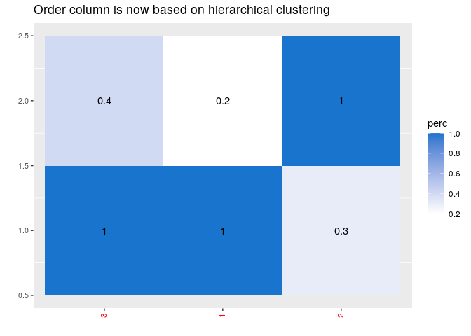

# ggoheatmap

The `ggorder_heatmap()` function plots a dataframe using `geom_tile()`
where both x- and y plotting order can be provided as arguments. It does
not perform clustering of the data, this is performed separately to
generate the sort order. For example, sort order can be generated by the
`hclust` set of algorithms.

Most R heatmap functions or packages combine clustering and plotting in
a single function. However, there are many ways to order the rows and
columns of a dataset, and I felt that separating the clustering from the
plotting makes things easier to use.

## install package

Use `devtools::install_github("gsverhoeven/ggoheatmap")` to install the
package from Github.

## use package

``` r
library(tidyverse)
```

    ## ── Attaching packages ─────────────────────────────────────── tidyverse 1.3.1 ──

    ## ✓ ggplot2 3.3.5     ✓ purrr   0.3.4
    ## ✓ tibble  3.1.7     ✓ dplyr   1.0.8
    ## ✓ tidyr   1.1.4     ✓ stringr 1.4.0
    ## ✓ readr   2.1.1     ✓ forcats 0.5.1

    ## ── Conflicts ────────────────────────────────────────── tidyverse_conflicts() ──
    ## x dplyr::filter() masks stats::filter()
    ## x dplyr::lag()    masks stats::lag()

``` r
library(ggoheatmap)
```

# Create an example dataset

First we create a dataframe that contains a 2 x 3 matrix of percentages,
in the `long` format, suitable for `ggplot`. It contains two special
columns: `col_order`, that specifies the plotting order of the x value,
and `xlab`, the label of the x axis.

``` r
df <- data.frame(x = c(1, 1, 2, 2, 3, 3), 
                  y = c(1, 2, 1, 2, 1, 2), 
                  perc = c(1, 0.2, 0.3, 1, 1, 0.4), 
                  col_order = c(2, 2, 1, 1, 0, 0),
                  xlab = as.factor(c("Foo", "Foo", "Bar", "Bar", "Hello", "Hello")))

df
```

    ##   x y perc col_order  xlab
    ## 1 1 1  1.0         2   Foo
    ## 2 1 2  0.2         2   Foo
    ## 3 2 1  0.3         1   Bar
    ## 4 2 2  1.0         1   Bar
    ## 5 3 1  1.0         0 Hello
    ## 6 3 2  0.4         0 Hello

Next, we show first the default behavior, which is to plot the dataset
“as is”:

<!-- xlab_var = "xlab" does not work yet -->

``` r
ggorder_heatmap(df,
                value_var = "perc")
```


Then, we show how we can tell `ggorder_heatmap()` which column contains
the sort order of the x axis. `ggorder_heatmap()` returns a ggplot2
object that can be further modified using ggplot functions, i.e. by
adding axis and title labels.

``` r
ggorder_heatmap(df,
                value_var = "perc", 
                order_var = "col_order") + 
  labs(y = "Y value") +
  ggtitle("Now with ordered x axis")
```


# Hierarchical clustering with ggorder_heatmap

The package contains a function `hclust_order` that adds a
`cluster_order` column to a dataset based on hierarchical clustering
using `hclust`.

<!-- PM # check if dist_method "euclidean", "maximum", "manhattan", "canberra", "binary" or "minkowski" also work  -->

``` r
df_clust <- hclust_order(df,
                   clust_method = "complete",
                   dist_method = "euclidean")

df_clust
```

    ##    x cluster_order y perc col_order  xlab
    ## 1: 1             2 1  1.0         2   Foo
    ## 2: 1             2 2  0.2         2   Foo
    ## 3: 2             3 1  0.3         1   Bar
    ## 4: 2             3 2  1.0         1   Bar
    ## 5: 3             1 1  1.0         0 Hello
    ## 6: 3             1 2  0.4         0 Hello

``` r
ggorder_heatmap(df_clust, 
                value_var = "perc", 
                order_var = "cluster_order") +
  ggtitle("Order column is now based on hierarchical clustering")
```



# Palmer penguins

Lets try it with a bigger dataset, `palmerpenguins`.

First we have to get it in a long format.

``` r
library(palmerpenguins)

df <- penguins
df$row_id <- 1:nrow(df)

df_long <- df %>%
  slice_sample(n = 30) %>%
  pivot_longer(cols = !c(species, island, sex, row_id, year), names_to = "variable")
```

Let’s plot all the (numeric) values of a random sample of 30 penguins:

``` r
ggorder_heatmap(df_long, xvar = "row_id", yvar = "variable", order_var = "row_id") 
```


